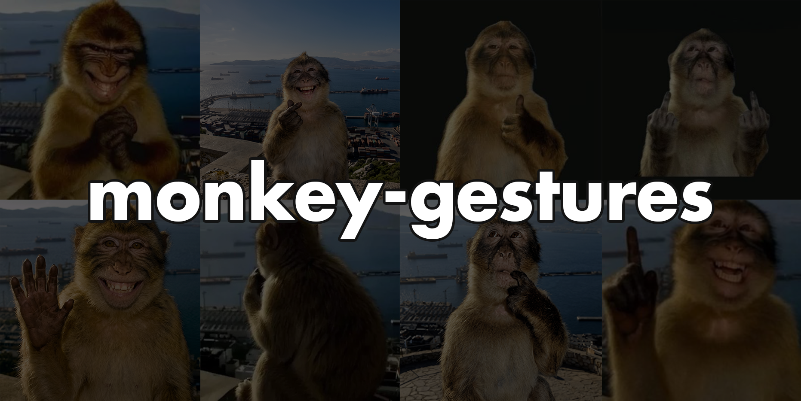

# Monkey Gestures

A real-time hand gesture recognition system powered by MediaPipe landmarks and Random Forest.

> **Note:** The model does not categorize all gesture classes available in external datasets. It is specifically trained on the 8 target gestures defined below.

## Target Gestures

| ID | Name | Description |
|---|---|---|
| `0` | **NONE / IDLE** | Idle state, relaxed hand, or no gesture |
| `1` | **LIKE / THUMBS UP** | Thumbs up gesture |
| `2` | **HEY / OPEN HAND** | Open palm |
| `3` | **POINT UP** | Index finger pointing upwards |
| `4` | **HEART / OK** | Heart shape formed with all fingers (`heart1` in HaGRID + custom data) |
| `5` | **THINKING** | Curved index finger placed near lips (custom data only) |
| `6` | **EVIL / CLENCHED FIST** | Clenched fist in all orientations |
| `7` | **MIDDLE FINGER** | Extended middle finger alone, without thumb |

## Datasets Used

- [LeapGestRecog (Kaggle)](https://www.kaggle.com/datasets/gti-upm/leapgestrecog)
- [HaGRID](https://github.com/hukenovs/hagrid) (only MediaPipe-extracted landmarks)